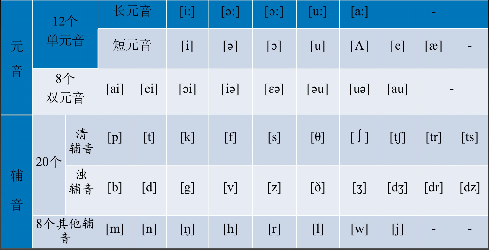

##  2022-12-13 06:36:12

学英语

精品英语直播课，第三次直播：鸡血，第140分钟50秒  
音标复习：https://baijiahao.baidu.com/s?id=1747439324819545438&wfr=spider&for=pc   
音标复习2: https://www.bilibili.com/video/BV1Jf4y1K7wx/  

国际音标一共48个，包含20个元音、28个辅音。元音分12个单元音、8个双元音。  
一个单词里至少包含一个元音，可以没有辅音。  
元音字母发元音，辅音字母发辅音。  

---

读音标

[精品英语直播课，第二次直播：英标，第130分钟10秒,48个英标视频](./source/48-english-marks.mp4)

